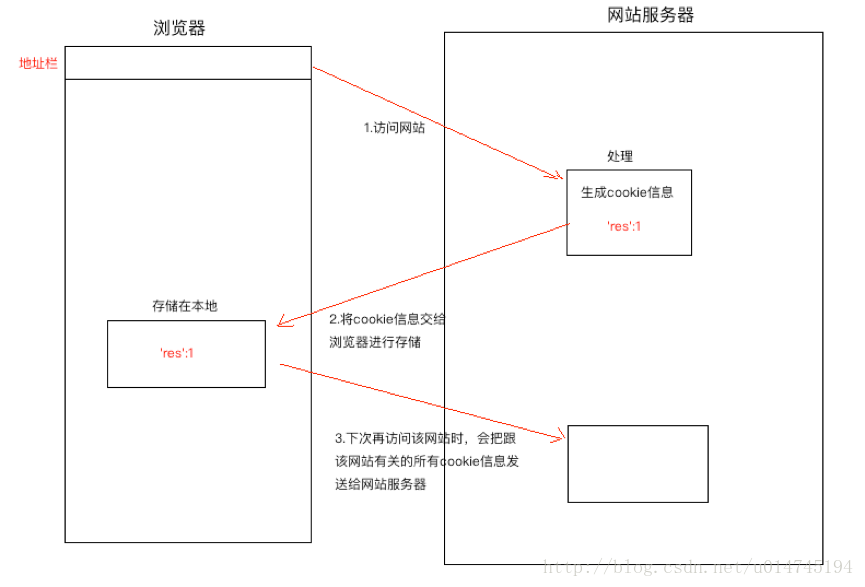
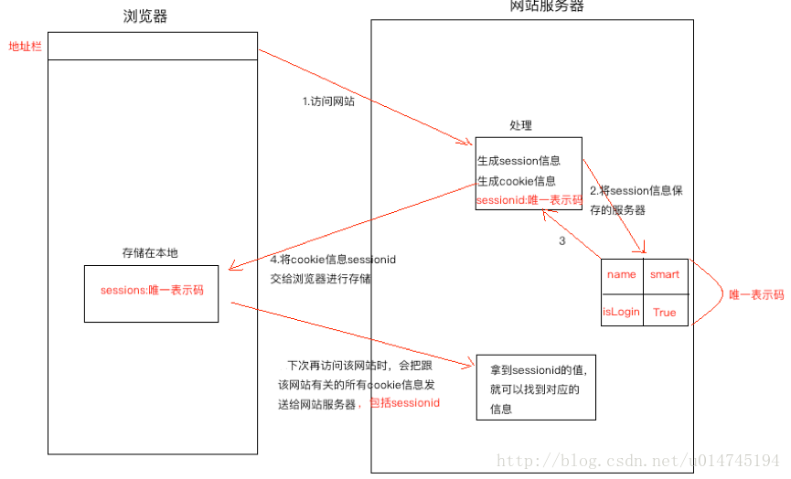

## 1，定义

浏览器请求服务器是无状态的。无状态指一次用户请求时，浏览器、服务器无法知道之前这个用户做过什么，每次请求都是一次新的请求。无状态的应用层面的原因是：浏览器和服务器之间的通信都遵守HTTP协议。根本原因是：浏览器与服务器是使用Socket套接字进行通信的，服务器将请求结果返回给浏览器之后，会关闭当前的Socket连接，而且服务器也会在处理页面完毕之后销毁页面对象。

有时需要保持下来用户浏览的状态，比如用户是否登录过，浏览过哪些商品等。 实现状态保持主要有两种方式：

- 在客户端存储信息使用Cookie。
- 在服务器端存储信息使用Session。

## 2，Cookie



### 定义

Cookie，有时也用其复数形式Cookies，指某些网站为了辨别用户身份、进行session跟踪而储存在用户本地终端上的数据（通常经过加密）。Cookie最早是网景公司的前雇员Lou Montulli在1993年3月的发明。

Cookie是由服务器端生成，发送给User-Agent（一般是浏览器），浏览器会将Cookie的key/value保存到某个目录下的文本文件内，下次请求同一网站时就发送该Cookie给服务器（前提是浏览器设置为启用cookie）。

Cookie名称和值可以由服务器端开发自己定义，这样服务器可以知道该用户是否合法用户以及是否需要重新登录等。服务器可以利用Cookies包含信息的任意性来筛选并经常性维护这些信息，以判断在HTTP传输中的状态。

Cookies最典型的应用是判定注册用户是否已经登录网站，用户可能会得到提示，是否在下一次进入此网站时保留用户信息以便简化登录手续，这些都是Cookies的功用。另一个重要应用场合是“购物车”之类处理。用户可能会在一段时间内在同一家网站的不同页面中选择不同的商品，这些信息都会写入Cookies，以便在最后付款时提取信息。

Cookie是存储在浏览器中的一段纯文本信息，建议不要存储敏感信息如密码，因为电脑上的浏览器可能被其它人使用。

### Cookie的特点

- Cookie以键值对的格式进行信息的存储。
- Cookie基于域名安全，不同域名的Cookie是不能互相访问的，如访问baidu.com时向浏览器中写了Cookie信息，使用同一浏览器访问baidu.com时，无法访问到baidu.com写的Cookie信息。
- 当浏览器请求某网站时，会将本网站下所有Cookie信息提交给服务器。

### 典型应用：记住用户名，网站的广告推送。

说明：广告推送的商品是基于你曾经在淘宝上点击的商品类别等条件筛选出来的，看上去这是在京东上访问淘宝网的Cookie，但是事实不是这样的，一般是采用iframe标签嵌套一个淘宝的广告页面到京东网的页面上，所以淘宝的Cookie并没有被京东网读取到，而是依然交给淘宝网读取的，可以通过“开发者工具”查看元素。


### 使用

```
response.set_cookie(key,value,...)
request.COOKIES.get('key')
```


## 3，Session



### 应用

> 对于敏感、重要的信息，建议要储在服务器端，不能存储在浏览器中，如用户名、余额、等级、验证码等信息。
>  在服务器端进行状态保持的方案就是Session。

### 启用和禁用Session

- Django项目默认启用Session。
- 禁用Session：将Session中间件删除。

```
MIDDLEWARE_CLASSES = (
    'django.contrib.sessions.middleware.SessionMiddleware',
    'django.middleware.common.CommonMiddleware',
    'django.middleware.csrf.CsrfViewMiddleware',
    'django.contrib.auth.middleware.AuthenticationMiddleware',
    'django.contrib.auth.middleware.SessionAuthenticationMiddleware',
    'django.contrib.messages.middleware.MessageMiddleware',
    'django.middleware.clickjacking.XFrameOptionsMiddleware',
    'django.middleware.security.SecurityMiddleware',
)
```

### 存储方式

打开项目的settings.py文件，设置SESSION_ENGINE项指定Session数据存储的方式，可以存储在数据库、缓存、Redis等。

- 1.存储在数据库中，如下设置可以写，也可以不写，这是默认存储方式。注意使用数据库存储，需要在项目INSTALLED_APPS中安装Session应用。然后执行迁移，才会在数据库中生成session表

> SESSION_ENGINE='django.contrib.sessions.backends.db'

- 2.存储在缓存中：存储在本机内存中，如果丢失则不能找回，比数据库的方式读写更快。

> SESSION_ENGINE='django.contrib.sessions.backends.cache'

- 3.混合存储：优先从本机内存中存取，如果没有则从数据库中存取。

> SESSION_ENGINE='django.contrib.sessions.backends.cached_db'

### 依赖于Cookie

> 所有请求者的Session都会存储在服务器中，服务器如何区分请求者和Session数据的对应关系呢？
>  答：在使用Session后，会在Cookie中存储一个sessionid的数据，每次请求时浏览器都会将这个数据发给服务器，服务器在接收到sessionid后，会根据这个值找出这个请求者的Session。

> 结果：如果想使用Session，浏览器必须支持Cookie，否则就无法使用Session了。

> 存储Session时，键与Cookie中的sessionid相同，值是开发人员设置的键值对信息，进行了base64编码，过期时间由开发人员设置。

### session对象及方法操作

通过HttpRequest对象的Session属性进行会话的读写操作。

- 1 以键值对的格式写会话。

> request.session['键']=值

- 2.根据键读取值。

> request.session.get('键',默认值)

- 3.清除所有会话，在存储中删除值部分，保留键。

> request.session.clear()

- 4.清除会话数据，在存储中删除会话的整条数据。

> request.session.flush()

- 5.删除会话中的指定键及值，在存储中只删除某个键及对应的值。

> del request.session['键']

- 设置会话的超时时间，如果没有指定过期时间则两个星期后过期。
- 如果value是一个整数，会话将在value秒没有活动后过期。
- 如果value为0，那么用户会话的Cookie将在用户的浏览器关闭时过期。
- 如果value为None，那么会话永不过期。

> request.session.set_expiry(value)

### 使用Redis存储Session

会话还支持文件、纯cookie、Memcached、Redis等方式存储，下面演示使用redis存储。

- 1,安装包。

> pip install django-redis-sessions

- 2,修改项目settings文件，增加如下项：

```
#配置将session信息保存在redis数据库中
SESSION_ENGINE = 'redis_sessions.session' #讲session信息保存在redis数据库中
SESSION_REDIS_HOST = 'localhost' #redis数据库所在主机
SESSION_REDIS_PORT = 6379 #redis数据库的端口号
SESSION_REDIS_DB = 1 #使用哪个数据库
SESSION_REDIS_PASSWORD = '' #密码
SESSION_REDIS_PREFIX = 'session'
```

- 3,打开应用app下views.py文件，修改session_test视图如下：

```
def session_test(request):
    request.session['name']='xiaoke'
    # name=request.session.get('name')
    # del request.session['name']
    # request.session.flush()
    return HttpResponse('成功')
```

- 4.管理redis的命令，需要保证redis服务被开启。

```
查看：ps ajx|grep redis
启动：sudo service redis start
停止：sudo service redis stop
使用客户端连接服务器：redis-cli
切换数据库：select 1
查看所有的键：keys *
获取指定键的值：get 键名
```

作者：晓可加油

链接：https://www.jianshu.com/p/c546aa70b1dd

來源：简书

简书著作权归作者所有，任何形式的转载都请联系作者获得授权并注明出处。