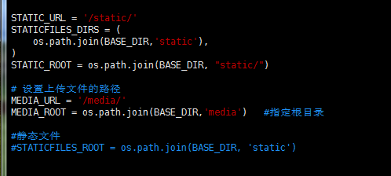
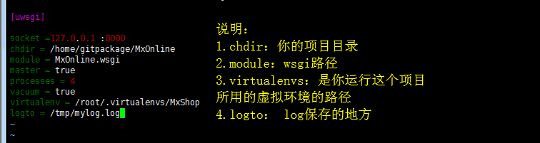
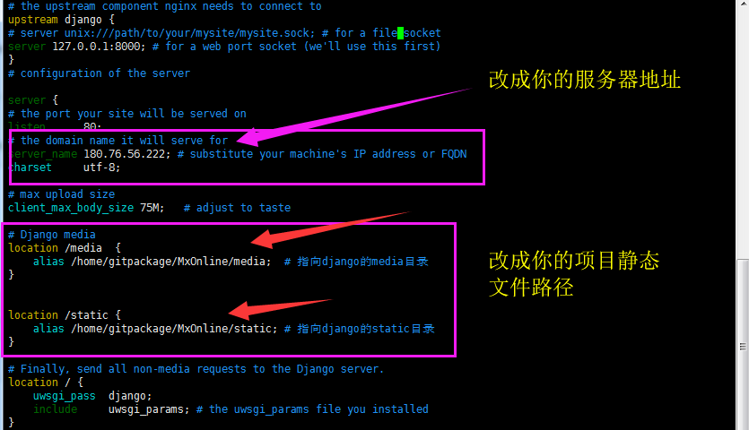
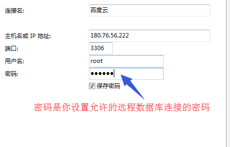
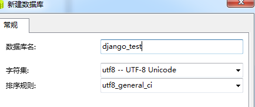
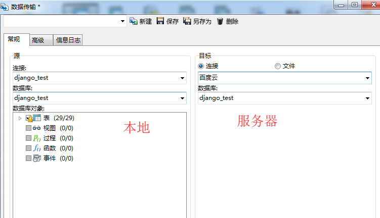

### **1.1.原理介绍**

django

-  一个基于python的开源web框架

uwsgi

-  一是一个web服务器，也可以当做中间件

nginx

- 常用高性能代理服务器

wsgi.py

- django项目携带的一个wsgi接口文件

nginx


```
Nginx是一个Http和反向代理服务器 
什么是反向代理服务器呢？

正向的就是由浏览器主动的想代理服务器发出请求，经代理服务器做出处理后再转给目标服务器
反向的就是不管浏览器同不同意，请求都会经过代理服务器处理再发给目标服务器
这其中的区别就是必须经过Nginx反向代理服务器，这就有了使用Nginx的几个好处：

安全：不管什么请求都要经过代理服务器，这样就避免了外部程序直接攻击web服务器
负载均衡：根据请求情况和服务器负载情况，将请求分配给不同的web服务器，保证服务器性能
提高web服务器的IO性能：这个我也没看懂，总结来说就是请求从客户端传到web服务器是需要时间的，
传递多长时间就会让这个进程阻塞多长时间，而通过反向代理，就可以在反向代理这完整接受请求，然后再
传给web服务器，从而保证服务器性能，而且有的一些简单的事情（比如静态文件）可以直接由反向代理处理，不经过web服务器
```


流程


```
首先客户端请求服务资源，
nginx作为直接对外的服务接口,接收到客户端发送过来的http请求,会解包、分析，
如果是静态文件请求就根据nginx配置的静态文件目录，返回请求的资源，
如果是动态的请求,nginx就通过配置文件,将请求传递给uWSGI；uWSGI 将接收到的包进行处理，并转发给wsgi，
wsgi根据请求调用django工程的某个文件或函数，处理完后django将返回值交给wsgi，
wsgi将返回值进行打包，转发给uWSGI，
uWSGI接收后转发给nginx,nginx最终将返回值返回给客户端(如浏览器)。
*注:不同的组件之间传递信息涉及到数据格式和协议的转换
```


作用

```
1. 第一级的nginx并不是必须的，uwsgi完全可以完成整个的和浏览器交互的流程； 
2. 在nginx上加上安全性或其他的限制，可以达到保护程序的作用； 
3. uWSGI本身是内网接口，开启多个work和processes可能也不够用，而nginx可以代理多台uWSGI完成uWSGI的负载均衡； 
4. django在debug=False下对静态文件的处理能力不是很好，而用nginx来处理更加高效。
```

 

**centos7的部署**

以全新服务器为例：


```
yum -y update

yum install gcc

yum -y install zlib*

yum install openssl-devel -y
```


### **1.2.ssh安装**


```
 yum install openssh-server -y

service sshd restart

#xshell连不上，SSH服务端不允许密码验证。
#服务端开启密码验证的方法：

vim /etc/ssh/sshd_config

把PasswordAuthentication项为yes

重启服务

service sshd restart
```


 

### **11.2.mysql安装**


```
#1.安装
wget http://dev.mysql.com/get/mysql-community-release-el7-5.noarch.rpm
rpm -ivh mysql-community-release-el7-5.noarch.rpm
yum install mysql-community-server

#2.重启服务
service mysqld restart

#3. 设置bind-ip

    vim /etc/my.cnf
    在 [mysqld]:
        下面加一行
        bind-address = 0.0.0.0

#4.登录mysql
mysql -u root

#5. 设置外部ip可以访问
#mysql中输入命令：
#后面用navicat连接远程服务器mysql的用户名和密码
GRANT ALL PRIVILEGES ON *.* TO 'root'@'%' IDENTIFIED BY '123456' WITH GRANT OPTION;

FLUSH PRIVILEGES；

#6.设置mysql密码
进入mysql：
set password =password('123456');     #密码123456
flush privileges;
```


 

### **11.3.pip和python3.6的安装**

```
#安装pip

wget https://bootstrap.pypa.io/get-pip.py  --no-check-certificate

sudo python get-pip.py
```


```
#安装python3.6
1. 获取

wget https://www.python.org/ftp/python/3.6.2/Python-3.6.2.tgz
tar -xzvf Python-3.6.2.tgz -C  /tmp
cd  /tmp/Python-3.6.2/

2. 把Python3.6安装到 /usr/local 目录

./configure --prefix=/usr/local
make
make altinstall

3. 更改/usr/bin/python链接

ln -s /usr/local/bin/python3.6 /usr/bin/python3
```


 

### **11.4.虚拟环境安装**


```
yum install python-setuptools python-devel
pip install virtualenvwrapper

#编辑.bashrc文件
vim ~/.bashrc

#添加进去
export WORKON_HOME=$HOME/.virtualenvs
source /usr/bin/virtualenvwrapper.sh

#sudo find / -name virtualenvwrapper.sh      查看你的virtualenvwrapper.sh在什么地方

#重新加载.bashrc文件
source ~/.bashrc

#虚拟环境保存的路径
cd ~/.virtualenvs/      （创建的虚拟环境都会保存在这个目录，前面设置的）

#创建指定python版本的虚拟环境方法
mkvirtualenv -p /usr/local/bin/python3.6 MxOnline

workon MxShop

#进虚拟环境安装依赖包

首先 pip freeze > requirements.txt 将本地的虚拟环境安装包导出来，上传到服务器

pip install -r requirements.txt

#安装mysqlclient出问题

    centos 7：
        yum install python-devel mariadb-devel -y

    ubuntu：
        sudo apt-get install libmysqlclient-dev

    然后：
        pip install mysqlclient
```


 

### **11.5.git安装**


```
yum install git

git config --global user.name "Your Name"
git config --global user.email "youremail@domain.com"

cd ~/ && ssh-keygen -t rsa -C "你的邮箱"

#提示的信息，直接按enter就行

cd .ssh

把公钥文件（id_rsa.pub）中的码复制到github

#就可以开始clone代码了

git clone git@github.com:derek-zhang123/MxOnline.git
```


**这是我的项目目录和虚拟环境目录**

- **项目目录：          /home/gitpackage/MxOnline**
- **虚拟环境目录：  /root/.virtualenvs/MxShop**

 

### **11.6.拉取项目静态文件**


```
#在django的setting文件中，添加下面一行内容：

    STATIC_ROOT = os.path.join(BASE_DIR, "static/")

#运行命令
    python manage.py collectstatic
```


 

 

 **settings中其它需要设置的地方**

```
DEBUG = True

ALLOWED_HOSTS = ['*']   #自己设置可以访问的域名，‘*’代表所有都可以访问
```

 

### **11.7.uwsgi**

（1）安装

进虚拟环境安装

```
workon MxOnline

pip install uwsgi
```

（2）在项目目录下新建uwsgi.ini文件

MxOnine/uwsgi.ini


```
[uwsgi]

socket =127.0.0.1:8000
chdir = /home/gitpackage/MxOnline
module = MxOnline.wsgi
master = true
processes = 4
vacuum = true
virtualenv = /root/.virtualenvs/MxShop
logto = /tmp/mylog.log
```




```
注：
    chdir：     表示需要操作的目录，也就是项目的目录
    module：    wsgi文件的路径
    processes： 进程数
    virtualenv：虚拟环境的目录
```

### **11.8.nginx**

（1）安装

这里有安装方法：`https://www.digitalocean.com/community/tutorials/how-to-install-nginx-on-centos-7`


```
sudo yum install nginx

#可能会用到的命令
service nginx restart
service nginx stop
service nginx start
```


 

（2）配置文件

在/etc/nginx/conf.d下新建MxOnline.conf


```
# the upstream component nginx needs to connect to
upstream django {
# server unix:///path/to/your/mysite/mysite.sock; # for a file socket
server 127.0.0.1:8000; # for a web port socket (we'll use this first)
}
# configuration of the server

server {
# the port your site will be served on
listen      80;
# the domain name it will serve for
server_name 180.76.56.222; # substitute your machine's IP address or FQDN
charset     utf-8;

# max upload size
client_max_body_size 75M;   # adjust to taste

# Django media
location /media  {
    alias /home/gitpackage/MxOnline/media;  # 指向django的media目录
}


location /static {
    alias /home/gitpackage/MxOnline/static; # 指向django的static目录
}

# Finally, send all non-media requests to the Django server.
location / {
    uwsgi_pass  django;
    include     uwsgi_params; 
}
}
```


 

 **配置好后**

```
nginx -t       #提示success说明没问题

service nginx restart
```

 

### **11.9.navicat数据传输**

一切都配置好后，把本地数据库的数据传到服务器上面

（1）连接你的服务器数据库



（2）新建项目数据库



（3）传输数据



 

 

 数据传输完成，配置也都配置好后，就可以开始访问了


```
#创建超级用户

python manage.py createsuperuser

#把uswgi服务开启

uwsgi --ini uwsgi.ini 

#访问
http://你的ip地址/
```


 

 

 

 

**ubuntu的基本环境搭建**


```
sudo apt-get update

apt-get install gcc 

apt-get install libssl-dev

sudo apt-get install openssl


apt-get install zlib1g

apt-get install zlib1g.dev
```


 mysql


```
sudo apt-get install mysql-server

输入密码

mysql -u root -p

sudo vim /etc/mysql/mysql.conf.d/mysqld.cnf

 bind-address = 0.0.0.0    #添加进去

sudo service mysql restart

#设置远程访问

GRANT ALL PRIVILEGES ON *.* TO 'root'@'%' IDENTIFIED BY '123456' WITH GRANT OPTION;

flush privileges;
```


 pip和python3.6

```
wget https://bootstrap.pypa.io/get-pip.py  --no-check-certificate

sudo python get-pip.py
```


```
wget https://www.python.org/ftp/python/3.6.2/Python-3.6.2.tgz

tar -xzvf Python-3.6.2.tgz -C  /tmp
cd  /tmp/Python-3.6.2/

2. 把Python3.6安装到 /usr/local 目录

./configure --prefix=/usr/local
make
make altinstall

3. 更改/usr/bin/python链接

ln -s /usr/local/bin/python3.6 /usr/bin/python3
```


 虚拟环境


```
pip install virtualenv
pip install virtualenvwrapper

vim ~/.bashrc

export WORKON_HOME=$HOME/.virtualenvs
source /usr/local/bin/virtualenvwrapper.sh

source ~/.bashrc
mkvirtualenv MxOnline --python=python3.6

worko MxOnline

sudo apt-get install libmysqlclient-dev

pip install -r requirements.txt
```


 git

```
sudo apt-get update
sudo apt-get install git

git config --global user.name "Your Name"
git config --global user.email "youremail@domain.com"
```

如果安装软件时候报错


```
 E: Sub-process /usr/bin/dpkg returned an error code (1)错误解决

在用apt－get安装软件时出现了类似于
install-info: No dir file specified; try --help for more information.dpkg：处理 gettext (--configure)时出错： 子进程 post-installation script 返回了错误号 1 在处理时有错误发生：
findutils
E: Sub-process /usr/bin/dpkg returned an error code (1)
办法如下：
1.$ sudo mv /var/lib/dpkg/info /var/lib/dpkg/info_old //现将info文件夹更名
2.$ sudo mkdir /var/lib/dpkg/info //再新建一个新的info文件夹
3.$ sudo apt-get update,再$sudoapt-get -f install //不用解释了吧
4.$ sudo mv /var/lib/dpkg/info/* /var/lib/dpkg/info_old //执行完上一步操作后会在新的info文件夹下生成一些文件，现将这些文件全部移到info_old文件夹下
5.$ sudo rm -rf /var/lib/dpkg/info //把自己新建的info文件夹删掉
6.$ sudo mv /var/lib/dpkg/info_old /var/lib/dpkg/info //把以前的info文件夹重新改回名字
到此问题顺利解决
```


 

github


```
cd ~/ && ssh-keygen -t rsa -C "你的邮箱"

#提示的信息，直接按enter就行

cd .ssh

把公钥文件（id_rsa.pub）中的码复制到github

#就可以开始clone代码了

git clone git@github.com:derek-zhang123/MxOnline.git
```

