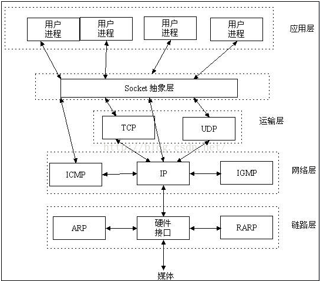
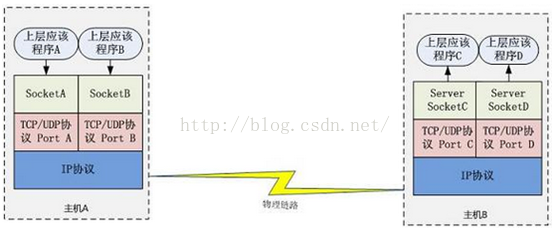

**Socket是什么**

Socket是应用层与TCP/IP协议族通信中间软件抽象层，它是一组接口。在设计模式中，Socket其实就是一个facade模式，它把复杂的TCP/IP协议族隐藏在Socket接口后面，对用户来说，一组简单的接口就是全部，让Socket去组织数据，以符合指定的协议。

****

**通信过程：**

****

主机A的应用程序要能和主机B的应用程序通信，必须通过Socket建立连接，而建立Socket连接必须需要底层TCP/IP协议来建立TCP连接。建立TCP连接需要底层IP协议来寻址网络中的主机。网络层使用的iP协议可以帮助我们根据IP地址来找到目标主机，但是一台主机上可能运行着多个应用程序，如何才能与指定的应用程序通信就要通过端口号来指定。这样就可以通过Socket实例唯一代表一个主机上的一个应用程序的通信链路了。

建立通信链路

当客户端要与服务器端通信，客户端首先要创建一个Socket实例，操作系统将为这个Socket实例分配一个没有被使用的本地端口号，并创建一个包含本地和远程地址、端口号的套接字数据结构，这个数据结构将一直保存在系统中直到这个连接关闭。在创建Socket实例的构造函数正确返回之前，将要进行TCP的三次握手协议，TCP握手协议完成后，Socket实例对象将创建完成，否则将抛出IOException错误。