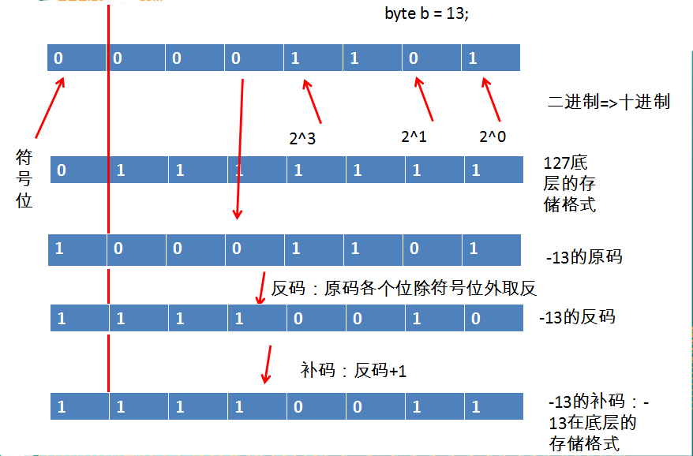
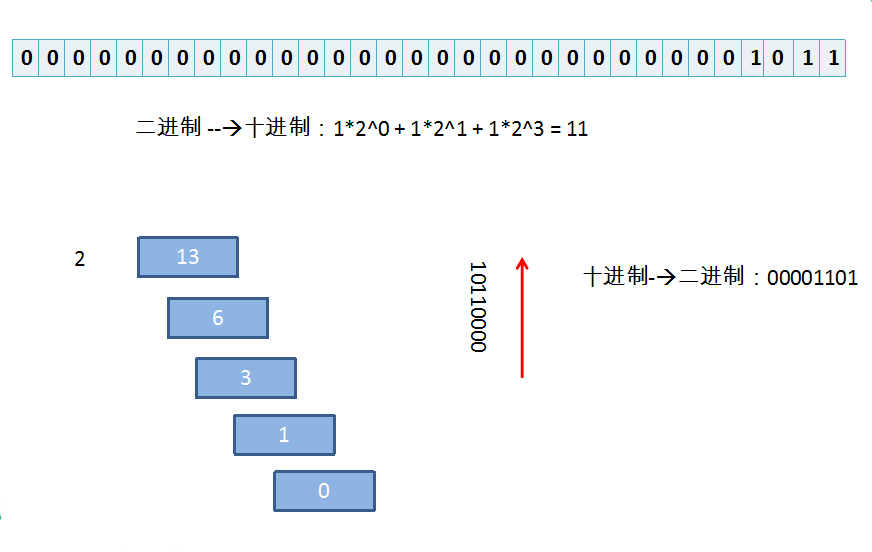
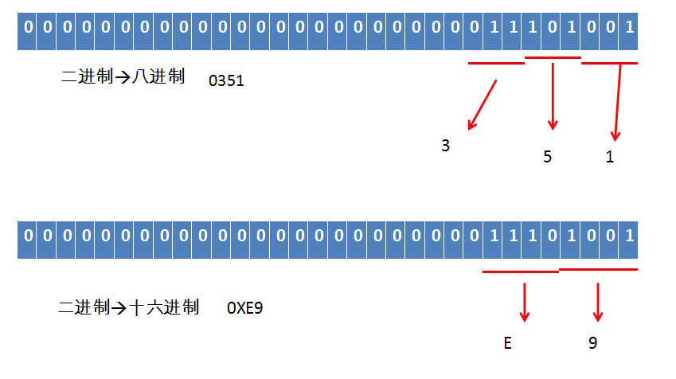
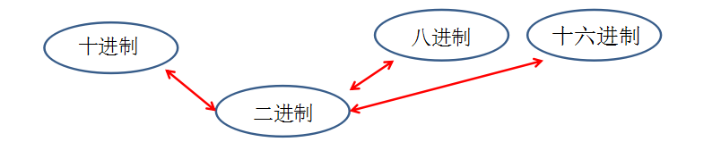

对于整数，有四种表示方式：

  二进制：0,1 ，满2进1.以0b或0B开头。

  十进制：0-9 ，满10进1.

  八进制：0-7 ，满8进1. 以数字0开头表示。

  十六进制：0-9及A-F，满16进1. 以0x或0X开头表示。此处的A-F不区分大小写。

​    如：0x21AF +1= 0X21B0

| **0** | **1** | **2** | **3** | **4** | **5** | **6** | **7** | **8** | **9** | **10** | **11** | **12** | **13** | **14** | **15** |
| ----- | ----- | ----- | ----- | ----- | ----- | ----- | ----- | ----- | ----- | ------ | ------ | ------ | ------ | ------ | ------ |
| 0     | 1     | 2     | 3     | 4     | 5     | 6     | 7     | 8     | 9     | A      | B      | C      | D      | E      | F      |

**1.原码、反码、补码**

  所有数字在计算机底层都以二进制形式存在。
  计算机以补码的形式保存所有的整数。
    正数的原码、反码、补码都相同
    负数的补码是其反码加1。
  原码：直接将一个数值换成二进制数。
  反码：是对原码按位取反，只是最高位（符号位）确定为1。
  Java整数常量默认是int类型，当用二进制定义整数时，其第32位是符号位；当是long类型时，二进制默认占64位，第64位是符号位

**2.进制间转化**
 十进制二进制互转
    二进制转成十进制  乘以2的幂数
    十进制转成二进制  除以2取余数

二进制八进制互转

二进制十六进制互转

[十进制八进制互转](https://s4.51cto.com/wyfs02/M01/97/5F/wKiom1kuIGfSNqR_AABAaZfqVew465.png)

[十进制十六进制互转
](https://s4.51cto.com/wyfs02/M01/97/5F/wKiom1kuIGfSNqR_AABAaZfqVew465.png)

