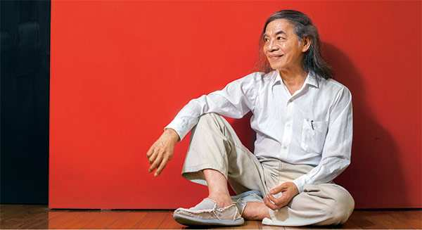

媒体是对现实世界中事件的有损和有偏见的压缩，并且通过自己的仪式，状态游戏和激励措施进行单独消费，”正如三次SaaS创始人Patrick McKenzie

Most of all, don’t let the headlines rule your worldview. “The press is a lossy and biased compression of events in the actual world, and is singularly consumed with its own rituals, status games, and incentives,” as three-time SaaS founder Patrick McKenzie [put it](https://twitter.com/patio11/status/936616122949844992).

那么什么是解药？嗯，这很无聊：小心谨慎。每当您认为自己已经确定趋势或模式时，请务必寻找反例。资源确实存在，但并不总是在Google搜索结果的第一页上。

So what’s the antidote? Well, it’s boring: Being careful and thorough. Make sure to look for counterexamples whenever you think you’ve identified a trend or a pattern. Resources do exist, although not always on the first page of Google results.

请听沃尔特·李普曼（Walter Lippmann）1922年的“ [*公众舆论*](https://www.gutenberg.org/ebooks/6456) ”（[*Public Opinion）*](https://www.gutenberg.org/ebooks/6456)一书。“回顾过去，我们可以看到我们如何间接了解我们生活的环境，”Lippmann写道，反映了第一次世界大战期间嘀嗒报告的不准确性。“我们现在可以看到它的新闻快速传达给我们，现在慢慢地; 但无论我们认为什么是真实的画面，我们都把它看作是环境本身。“

Listen to Walter Lippmann, in his 1922 book [*Public Opinion*](https://www.gutenberg.org/ebooks/6456). “Looking back we can see how indirectly we know the environment in which nevertheless we live,” Lippmann wrote, reflecting on the inaccuracies of tick-tock reporting during World War I. “We can see that the news of it comes to us now fast, now slowly; but that whatever we believe to be a true picture, we treat as if it were the environment itself.”

[以上三段话]: https://www.sonyaellenmann.com/2018/06/survivorship-bias-and-startup-hype.html	"幸存者偏见"

美国最著名的物理学家、诺贝尔奖得主费曼，小时候与一个号称无所不知的孩子，一起出去玩。他后来回忆了两个人的一段对话。

> 他对我说："看那只鸟？ 那是什么鸟？"
>
> 我说："我一点也不知道它是一只什么样的鸟。"
>
> 他说："这是一只棕色喉咙画眉。 你父亲没教你吗？"
>
> 事实恰恰相反。 他[费曼的父亲]已经教过我："看那只鸟？"他说。 "这是斯宾塞的鸣鸟。"（我知道他不知道真名。）"好吧，在意大利语中，这是一个Chutto Lapittida 。 在葡萄牙语中，它是一个Bom da Peida ...你可以在世界上所有语言中知道那只鸟的名字，但是当你说完后，你对这只鸟一无所知！ 你只会知道不同地方的人类怎么叫这只鸟。 所以，让我们看一下这只鸟，看看它在做什么 - 这就是最重要的。"
>
> 所以，我很早就知道了，知道某事物的名字和知道它是什么之间的区别。

[费曼的故事](http://augmentingcognition.com/ltm.html)

英国科幻小说家亚瑟.C.克拉克，提出了三个定律。

克拉克的第一定律：“如果一位杰出的老科学家表示，某些事情是可能的，那么他几乎肯定是对的。如果他说某事是不可能的，他很可能是错的。”

克拉克还补充说，上面定律里面“老人”的定义，取决于他所在的学科。“物理学、数学和航天科技中，超过三十岁的人就是老人；其他学科中，老人有时会推迟到四十岁。当然也有一些了不起的例外，但是每个刚刚大学毕业的研究人员都知道，超过五十岁的科学家只能去参加会议，其他什么也干不了，而且他本人也应该有自知之明，绝不要让自己去碰实验室的工作。”

克拉克的第二定律：“发现极限的唯一方法，就是尝试一些不可能的事情。”

克拉克的第三定律：“任何足够先进的技术都像魔术一样。”

# 不要碰任何东西

几年前，有人告诉我一个关于一家大型媒体公司的故事。他们不得不撕掉他们办公室的一部分地板进行维修，发现下面蜿蜒曲折的通信电缆。他们做了什么？更换并重新连接电缆？没有。当他们看到纠结的质量时，他们没有触及任何东西，并小心地更换了地板。谁知道每根电缆的引导位置以及它带有哪些内容？最好只留下原样。

在一个复杂的系统中，除非你了解你的改变如何使事情变得更好，否则最好只留下原样。

如果你想了解一个像怀表一样可预测的系统崩溃，请参阅[马克吐温](http://www.pocketwatchrepair.com/histories/twain2.html)。

# Don’t Touch Anything

Years ago someone told me a story about a big media company. They had to rip up part of the floor in one of their offices to make repairs and discovered a tangled mass of communications cables snaking underneath. What did they do? Replace and reconnect the cables? No. When they saw that tangled mass, they touched nothing down there and carefully replaced the floorboards. Who knows where each cable led and what content it carried? Better just to leave things as they were.

In a complicated system, unless you understand how your change make things better, better just to leave things as is.

And if you want to read about a system falling apart in something as predictable as a pocket watch, see [Mark Twain](http://www.pocketwatchrepair.com/histories/twain2.html).

[]: https://unintendedconsequenc.es/dont-touch-anything/	"UNINTENDED CONSEQUENCES"

抽象（abstraction）是计算机科学至关重要的思维方法，它帮助我们进行高层面的思考，而不为细节所累。

[]: http://www.yinwang.org/blog-cn/2018/04/13/computer-science

但是请不要被我这些话吓到了，你没有那么多的竞争者。现在的情况是，世界上就没有很多合格的计算机科学驾驶员，更不要说把车开得流畅的赛车手。绝大部分的“程序员”连最基本的引擎，油门，刹车，方向盘的工作原理都不明白，思维方式就不对，所以根本没法独自上路，一上路就出车祸。很多人把过错归结在自己的车身上，以为换一辆车马上就能成为好的驾驶员。这是一种世界范围的计算机教育的失败。

[解谜计算机科学]: http://www.yinwang.org/blog-cn/2018/04/13/computer-science

漫画家蔡志忠有一个演讲，题目叫做[《努力是没有用的》](https://www.yuque.com/book-academy/share/shp7tu)。读完这份演讲稿，我觉得他说的有道理。

有些人非常勤奋，别人休息和娱乐的时候，都在工作学习。但是努力了一辈子，人生也没有显著的提升，就像报道里经常说的："某某在平凡的岗位上，勤勤恳恳工作了一辈子"。

另一方面，很多成功者似乎也没有特别努力，就取得了许多成就，过上了好日子。蔡志忠以自己为例，他从小就喜欢画画，然后一直画，不知不觉就成了大漫画家，名利双收，从没有觉得过得很辛苦。

> 老师或父母老是说，努力就会走到巅峰----才怪。如果这样，不是所有人都走上巅峰了吗？没有人开始不努力，为什么后来不努力，因为努力没有效果。"
>
> 人生不是走斜坡，你持续走就可以走到巅峰；**人生像走阶梯，每一阶有每一阶的难点，**学物理有物理的难点，学漫画有漫画的难点，你没有克服难点，再怎么努力都是原地跳。所以当你克服难点，你跳上去就不会下来了。

蔡志忠的核心观点就是黑体的那句话，成功的人生是台阶式向上，而不是一条水平线。努力只是说明你拼命在走，跟你能不能向上走，关系不大。那些努力却没有结果的人，根本原因就在于，他一直走在平面上，没有走到更高的台阶。

也就是说，__垂直方向的努力更有意义，水平方向的努力意义不大。__你把同一件事情勤奋地做上十遍，还是只会做这一件事；你做完这件事后，再去挑战更难的事情，就有机会学会做两件事。

初学者经常问我，前端开发应该学习哪一个框架？我的回答就是，你觉得哪一个框架比较容易，就用那个。因为它们都是解决同样的问题，你只要知道怎么解决就可以了，没必要深究哪一个解决得更好。**对你更重要的是，要去解决更多的问题，而不是如何最好地解决一个问题。**

只有通过解决更多的问题，人生才能摆脱水平运动，进入上升运动。当然，这里还有一个天赋和兴趣的问题，如果找到属于你的领域，不用特别努力就能上台阶；如果找不对领域，再努力也只能做水平运动。