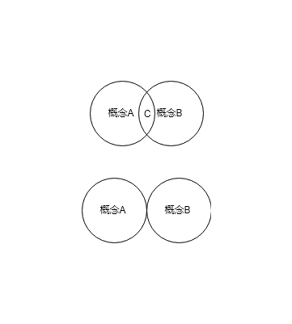
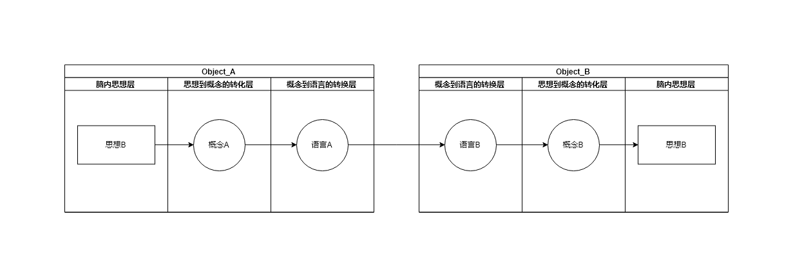
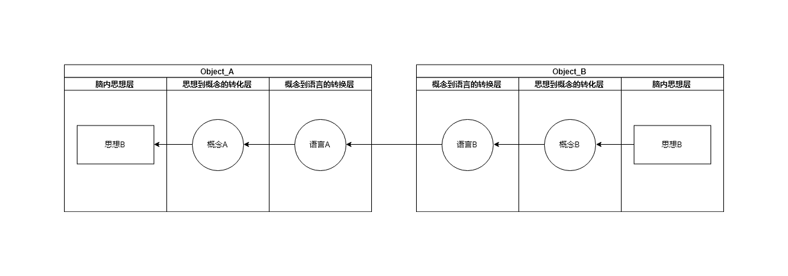

#### 1.歧义

人类的语言系统 与思考 都是建立在一个个的概念之上

像一些概念 如 爱 喜欢 鸟 都是对于一些事物的抽象 形成的 标记

这些标记就像一个集合,每个人的集合都不太一样

> TODO 有一个实例 调查 人对 一些 也许 大概 绝大部分

​                                                                               人可以正常交流,说明这些集合有交集,交集之外的可以被称为歧义

##### 交流

人为了交换信息 需要把信息表达出来, 一个交流模型类似于下图所示

语言的作用类似于中间件

###### 在上层应用程序和下层通讯软件和操作系统之间使用标准的编程接口和协议 这种标准化的接口和协议称作中间件(middleware),使用中间件能够构建这样的程序:能忽略不同的pc机和工作站上运行的差别,而且无论数据在什么位置都使用相同的方法来访问数据

[操作系统精髓与设计原理OperatingSystemsInternalsandDesignPrinciplesSixthEdition 486页中间件]: 	""

语言的产生使人可以以相同的方法来交换信息

##### 概念 的产生

> 那个物理学家 鸟

##### 人交流时的障碍 内隐

##### 为防止歧义

降低信息传递时的损耗 

减少对信息信号影响的因素

> 可以参考 网路线路连接方式 无线信号的传播方式 音频的压缩方式 

##### 语言的一些

交流是为了达到某些目的，所以说只是描述事实 ，是低效率的 偏离了目的

交流是引导，引导被交流的人

几点原则

1. 没有修饰 就是最好的修饰  即不要暴露出 目的性，太强的目的性会启动人的防御机制          

   形象来说就是为话 包糖纸，直接把糖果放到手上会很粘腻   包上糖纸就好多了

2. 引导性

   事实并不需要人们去陈述，人们自然会了解

   陈述是为了引导 被陈述人的思想走向 来达到交流的目的

   举例 

   A:我是一个坏人

   B:坏人？

   A:我刚才上了你的马子

   B:...

   A:卒

##### 为什么学校不是那么的让人开心

原则 吸引力 人会被吸引  但是讨厌被强迫

例如 当努力(专注于一个方面 长时间集中精力)的时候，很多人会感到痛苦，这样往往是因为那个方面没有吸引你，要想把 努力这个事件 完成并且能长时间维持 自己感到快乐   要做的不是加倍努力

加倍努力 只会让你加倍的痛苦 降低效率

要做的是如何让那个东西吸引你，当那个东西吸引你的时候 就是完成这个事件的时候

当那个东西吸引你的时候  努力会不自觉的加倍 快乐会不自觉的加倍 效率会不自觉的加倍

例如大部分的学校(是指现在的这种学校 参见ted) 会让学生厌烦,自然的心理上的厌烦。特别是向你强迫灌输一些东西的时候

有些人可能不会同意，因为有些人喜欢学习 但是有一种假性的喜欢

这些假性喜欢的人 往往不会快乐 他们因为一些事情 如未来的考虑 别人的目光 而不得不这样，这也符合这条原则，只不过他们只是在自己强迫自己

真正喜欢 是被吸引的 往往在没有像这样 未来的考虑 别人的目光 的外部因素，他们依然会很高兴的却做

原则就像是一个框架 你可以把很多东西填充到这个框架中    像爱情 婚姻 工作 兴趣爱好  人际关系

##### 因为所以 和 if else HOW

##### 一种描述方式

我们往往会有一个自己从某些事物中总结的抽象道理 或称之为 原理

一个故事(即一段描述)  可以简明生动的再现这个原理  打通被交流人的脑部结构

##### 当你用编程的思维去 组织思想 写作 说话

##### 搭讪学习 与机器学习  需要样本训练

##### 开车与学习车的结构

##### 把事物抽象为数学模型

##### 伟大 短暂而又残忍的 感觉

##### 假装的力量 the power of pretend

##### 吸引力

 人通常会被好奇 欲望所吸引

人通常会忽略自己所拥有的东西,可能与人的进化有关 人要生存下去

例如 单方面的付出,是愚蠢而不可取的

##### 失去理智

人不把自己这个生物体 "物理"上的 的利益放到第一位的时候 即为失去理智

但从某种方面来说 可以说是精神上并没有失去"理智",而是一种自私

##### 自私

自私 表面上来看是 一个生物体把自己的利益

##### 所谓精神上 和 物理上

不要刻意去记住某件事，而要去寻找使其显而易见的解释

##### 精确想象