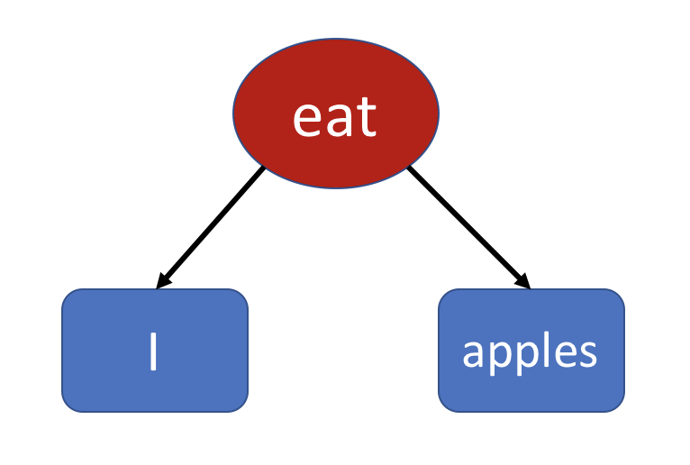
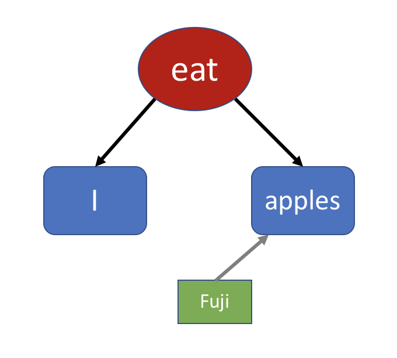
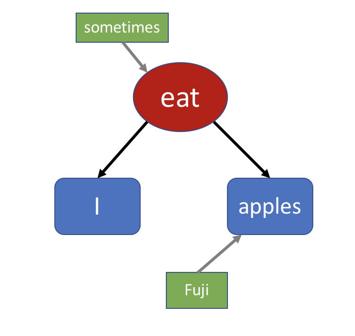
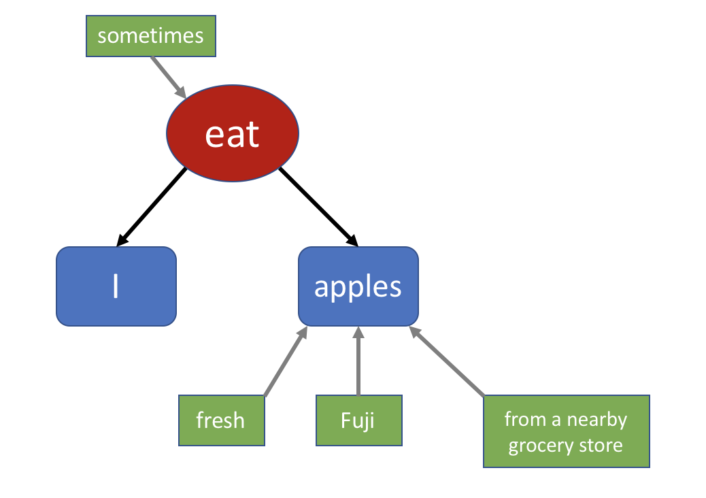
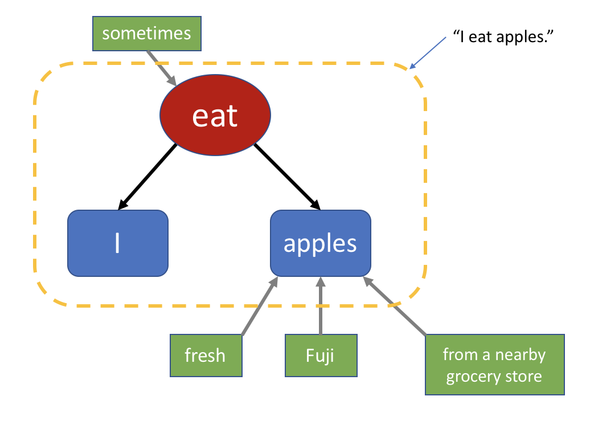

## 解谜英语语法

我发现很多人仍然在为语法的枯燥繁琐而头痛。市面上好像不存在一本深入本质的语法教材。语法对于我来说已经早就不是问题，所以我萌生了写这样一篇文章的念头，帮助那些正在为学习语法而痛苦挣扎的人们。

这篇文章里包含了一些我自己保留多年的关于英语学习的秘密。我曾经想过把这写成一本完整的语法书，可是后来发现似乎一篇文章足矣。

### 句子的核心地位

直到几百年前，各个不同大陆上的人还从来没见过面，他们的语言里却不约而同出现了同样的结构：句子。这似乎说明句子的出现是一种自然规律，必然结果，而不只是巧合。

句子是人类语言最核心的构造。为什么呢？因为人和人说话终究是为了一个目的：描述一件事。

这件事也许只有一个字：吃！

也许可以很长：昨天晚上在上海某路边餐厅吃的**鹅肝**，**是**我吃遍全世界**最好的**。

一个句子表达的就是一件事，或者叫一个“事件”。人与人交流，无非就是讲述一个个的事件。

许多人学英语，一来就背单词，背了很多单词，仍然写不出像样的句子来。只见树木不见森林，因为他们没有意识到句子才是最关键的部分。我们应该一开头就理解句子是什么，如何造出句子，而不是背单词。单词是树木，句子才是森林。

### 你需要的能力

所以掌握一门语言，基本就是要掌握句子。有了句子就有了一切。

掌握句子包括两种能力：

1. 能够迅速地**造出**正确的句子，准确地**表达**自己的意思。
2. 能够迅速地**分析**别人的句子，准确地**理解**别人的意思。

这两件事，一个是表达（发送），一个是理解（接收）。因为语言是沟通（或者叫“通讯”）的工具，所以它就只包含这两件事。

### 句子的本质

假设我们是原始人，还没有语言。我想告诉同伴“我吃苹果”这件事，该怎么表达呢？没有语言，那我可以先画个图嘛：

画图是很麻烦的，笔画太多不说，还可能有歧义。到后来，部落里的人聪明了一点，发明了“符号”这种东西，只需要几笔就能表示一个概念。他们给事物起了简单的符号名字，不再需要画图了。于是我们有了 I, apple 这样的词用来指代事物。有了 eat 这样的词，用来代表动作。所以画面变成这个样子：

后来干脆连框也不画了，直接写出这些符号来，这就是我们现在看到的“句子”：

> I eat apples.

注意，虽然没有了上面的框图，这句话其实隐含了这幅图。写这个句子的人假设阅读者能够从一串**符号**还原出一个**画面**（或者叫结构）来。

有些人不能理解别人的话，看书看不懂，就是没能从符号还原出结构来。很多语法书列举出千奇百怪的“组合情况”，为的只是帮助你从这串符号还原出结构来。在现代语言学和计算机科学里面，这个过程就叫做“语法分析”（parsing）。

### 动词是句子的核心

那么，你觉得“我吃苹果”这个事，里面最关键的部分是什么呢？是“我”，“苹果”，还是“吃”呢？

稍微想一下，你也许会发现，关键在于“吃”这个动作。因为那是我和苹果之间发生的**事件**。这句话是说“吃”这件事，而“我”或者“苹果”，只是“吃”的组成部分。

用 eat 这个词，你不但可以表达“我吃苹果”，还可以表达“他吃面条”，“猫吃老鼠”之类的很多事情。于是，聪明一点的人就把 eat 这个词提取出来，做成一个“模板”：

这个模板就是所谓“动词”。eat 这个动词给你留下两个空，填进去之后，左边的东西吃右边的。

句子是语言的核心，而动词就是句子的核心。动词是事件的关键，比如 eat。

> A eat B.

我们可以选择空格里的 A 或者 B 是什么。但不管怎么换，事情仍然是“吃”。为了描述方便，我们把 A 和 B 这两个空格叫做**参数**（parameter）。

这跟数学函数的参数（f(x) 里面那个 x）类似，也跟程序函数的参数类似。用数学或者程序的方式来表示这个句子，就是这样：

> eat(A, B)

其中 A 和 B，是动作 eat 的参数。我只是打个比方帮助你理解，当然我们不会这样写英语。如果你完全不懂数学或者编程，可以忽略这个比方。

动词决定了它可以有几个参数，它们可以在什么位置，参数可以是什么种类的成分。比如 eat，它可以有两个参数。这两个参数只能是某种“物体”。你不能放另一个动作（比如 walk）进去，也不能放一个形容词（比如 red）进去。这种动词对参数的约束，叫做参数的“类型”。

在这个例子里，eat 可以接受两个“名词”（noun），所以它的两个参数，类型都是 noun。

你可能注意到了，I eat apples 里面的“I”并不是名词，而是“代词”。我解释一下。我这里所说的“名词”，是泛指一切物体以及指代物体的名字。所以我叫做“名词”的东西，也包括了代词，比如 I, you, he, she, it。如果你回想一下代词的英文是 pronoun，就会意识到它和名词（noun）之间的关系。

你会发现这种扩展的“名词”，会大大方便我们的理解。在本书中除非特别指明，所谓“名词”包括了代词，以及一切可以被作为名词使用的结构（比如从句，动名词）。

一个句子除了动词，好像就只剩下动词的参数了。动词对它的参数具有决定性的作用，动词就是句子的核心。准确理解一个动词“想要什么参数”，什么样的结构可以出现在参数的位置，就是造出正确句子的关键。

使用不同的动词可以造出不同的句子。所以要理解语法，你在应该把大部分精力放在各种各样的动词身上，而不是花几个月时间去背名词和形容词。我并不是说名词和形容词不重要，只是它们并不是核心或者骨架。

没有人会怪你不认识某种恐龙的名字，但如果你不能理解“I am not used to eating garbage food.” 是什么意思，那你可能就有麻烦了。

### 具有三个参数的动词

现在举个复杂点的例子：

> Coffee **makes** me happy. （咖啡使我快乐）

这里的动词是 make。跟 eat 不大一样，make 可以接受三个参数：coffee, me, happy。它的模板可以表示为：

> A make B C 
> 意思是：A 使得 B 具有性质 C。

比如 Coffee makes me happy，其中 A 是 *coffee*，B 是 *me*，C 是 *happy*。

再来一个例子：

> I told you everything. （我告诉了你一切）

这里动词 tell 也有三个参数，它的模板是这样：

> A tell B C. 
> 意思是：A 告诉 B 一件事 C。

比如 I told you everything，其中 A 是 *I*，B 是 *you*，C 是 *everything*。

### 扯个淡：什么是宾补

说到这里我想扯个淡。初学者不知道什么是“宾补”的，可以跳过这一节，你不会损失什么。

在传统语法里，上面一节的 *A make B C* 和 *A tell B C* 被看做是不同的语法现象，前者被称为含有“宾语补足语”，后者含有“双宾语”。可是在我们的框架下，这两者都不过是“接受三个参数的动词”。你只需要熟悉 *A make B C* 和 *A tell B C* 是什么意思就可以了。

*A make B C* 里的 C 参数，其实就是传统语法叫做“宾语补足语”（宾补）的东西。然而跟传统语法不同，我不把它叫做“宾补”。这个成分没有任何特殊的名字和地位，而只是动词 make 的第三个参数。

有的动词可以有三个参数，有的动词只能有两个参数，有的动词只有一个参数。有的动词有时有两个参数，有时只有一个参数…… 就是这么简单，没有什么道理好讲，因为人们就是那么说话的。

人们约定俗成的说话方式，决定了 make 可以有三个参数，决定了这三者之间的关系：A 使得 B 变得 C。这就像数学的“定义”一样，是没有道理可讲的。你只需要多多练习，按照这个模板造句，知道它**具体**的意思就可以了。

模板“A make B C”，精确地决定了动词 make 可以产生的句型，定义了参数 A，B 和 C 之间的关系。你不需要把 C 叫做“宾补”就能明白这个句子在说什么。实际上，我认为“宾语补足语”，“补足语”这些术语，基本是子虚乌有的。它们来源于一种古板的观念，认为句子只有主谓宾三种成分，所以多出来一个东西，就只能叫做”补足语”了。他们没有意识到，有的动词可以有三个参数，就是这么简单。

### 如何造出正确的句子

我已经提到，对于人的语言能力，“造句”能力占了一半。很多人不知道复杂的长句是怎么造出来的，所以他们也很难看懂别人写的长句。

我并不是说一味追求长句是好事，正好相反。如果你能用短句表达出你的意思，就最好不要用长句。虽说如此，拥有造长句的“能力”是很重要的。这就像拥有制造核武器的能力是重要的，虽然我们可能永远不会用到核武器。

当然，长句不可能有核武器的难度。造长句其实挺容易。你先造出一个正确的短句，然后按照规则，一步步往上面添加成分，就可以逐渐“生成”一个长句。

这就像造一个房子，你首先打稳地基，用钢板造一个架子，然后往上面添砖加瓦。你可以自由地选择你想要的窗户的样式，瓦片的颜色，墙壁的材质，浴缸的形状…… 好像有点抽象了，我举个例子吧。

首先，我造一个最简单的句子。最简单的句子是什么呢？我们已经知道动词是句子的核心，有些动词自己就可以是一个句子。所以我们的第一个句子就是：

> eat.

它适用于这样的场景：你在碗里放上狗粮，然后对狗儿说：“吃。” 当然，你体会到了，这句话缺乏一些爱意，或者你只是早上起来还比较迷糊，不想多说一个字，但它至少是一个正确的句子。

接下来，我们知道 eat 可以加上两个参数，所以我就给它两个参数：I 和 apples。

> **I** eat **apples**. （我吃苹果）

这个句子适用于这样的场景：别人问我：“你一般吃什么水果呢？” 我说：“我吃苹果。”

有点单调，所以我再加点东西上去。

> I eat **Fuji apples**. （我吃富士苹果）

Fuji 被我加在了 apples 前面，它给 apples 增加了一个“修饰”或者“限定”。它只能是富士苹果，而不是其它种类的苹果。

但我并不总是吃富士苹果，我有时不吃苹果。我想表达我只是“有时”吃富士苹果，所以句子又被我扩充了：

> I **sometimes** eat Fuji apples. （我有时吃富士苹果）

你觉得这个 sometimes 是在修饰（限制）句子的哪个部分呢？它在修饰“我”，“苹果”，还是“吃”？实际上，它是在限制“吃”这个动作发生的频率，所以它跟 eat 的关系紧密一些，也就是说它是在修饰 eat，而不是 I 或者 apples。

以此类推，我们可以把它发展得很长：

> **I** sometimes **eat** fresh Fuji **apples** from a nearby grocery store.

我有时候吃从附近杂货店买来的新鲜富士苹果。注意，虽然这句子挺长，但它的“骨架”仍然是 I eat apples.

我已经演示了一个长句是怎么“生成”的。先造一个短句，然后往上面添砖加瓦。正确的短句，按照规则加上一些成分，就成为正确的长句。从正确走向正确，这样你的语法就会一直是正确的。

当然，扩展句子的时候，你不能随意往上加东西，它们必须满足一定的规则才能正确的衔接。比如，你只能把 Fuji 放在 apple 前面，而不是后面，from 之类的词不可少。这就像造房子，你不能在该放窗户的地方放一道门，你不能用错配件，漏掉胶水。所谓语法，很多时候就是在告诉你这些部件要怎么样才能接的上，就跟做木工活一样。

### 如何理解句子

人与人交流的另一个部分就是“接收”。如果书上有很长一句话，你要怎么才能理解它呢？许多人看到长句就头痛，不知道该怎么办。这是因为他们不明白长句都是从短句扩展出来的，是有结构的。许多人理解长句失败的原因，在于他们总是从左到右，一个个的扫描单词。开头几个词感觉还认识，再多看几个词，就不知道是怎么回事了。

其实理解长句的方法，都隐含在了上一节介绍的造长句的方法里面。造句的时候我们先勾画出一个框架，然后往里面填修饰的成分。理解的时候如果有困难，我们可以用类似的办法。我们首先分析出句子的**主干**，把这个框架理解了，然后再把其它成分放回去，逐步把握整个句子的含义。

这个分析主干的过程，往往是“跳跃式”的，而不是“顺序式”的扫描单词。

比如之前的那个例子：

> **I** sometimes **eat** fresh Fuji **apples** from a local grocery store.

你需要跳过修饰的成分，分析出句子的主干是短句“I eat apples”。如果你觉得一下子找不到主干，那么你可以挨个找到“修饰成分”，把它们逐个删掉，最后留下来的就是主干了。

注意，主干“I eat apples” 本身就是一个语法正确的句子，它满足所有的语法规则。于是你理解了它在说“我吃苹果”。然后你返回去再看几遍，逐渐加上细节，知道是什么样的苹果，从哪里买来的，什么时候吃。

漏掉或者误解了细节，你可能会误解一部分意思，但抓住了主干，你就不会完全不理解这个句子在说什么。

再次强调，每一个复杂的长句，里面都藏着一个非常短的，语法正确的短句。理解长句的关键，就在于找到这个核心的短句。

如何获得识别修饰成分，找到主干短句的能力，也在于你对具体的语法规则的理解。

### 句子的树状结构

之前，我们的原始人画了这样一个图：

它表示这样一个英语句子：

> I eat apples.

很多人觉得后者是更简洁，更先进的方法。然而他们没有意识到，原始人的图片里，其实包含了关键而本质的东西。被转换成一串符号之后，里面的结构看不见了，反而需要费一些脑筋才能理解。这个简单的情况也许不能说明问题，等句子复杂起来之后，你就能体会到这一点。

从现代语言学，计算机自然语言处理（NLP）的观点看来，句子并不是一串符号，而是一个“树状”的结构。我们把这种树叫做“语法树”。

比如 I eat apples，其实表示的是下图这样的结构：

你可以把这个图看成是一棵倒着长的树。你把屏幕旋转 180 度，就会看到一棵树。树干 eat 发出两个“分支”，连接着它的两个参数：I 和 apples。为了表达清晰，我用红色圆圈来表示动词，而用蓝色方形表示名词。

动词 eat 需要两个名词参数，我们给它 I 和 apples，就成了一个完整的句子。再次声明，我这里的“名词”，包括了像“I”这样的“代词”。

### 扩展一棵树

之前我们通过扩充 I eat apples 这句话，得到了一个逐渐变长的句子。现在有了“语法树”的概念，我们来重新演示一下这个扩充句子的过程，看看它对应的语法树是怎么变化的。

首先，我们给苹果加上“富士”（Fuji）的修饰：

> I eat **Fuji** apples.

Fuji 是对 apples 的修饰，或者说是它的“属性”，所以我们在树上把它和 apples 连在一起。

对于这种“修饰”成分，我们用绿色方框来表示。它们通过灰色箭头指向它们所修饰的部分。

接着，我们加上一个时间修饰 sometimes：

> I **sometimes** eat Fuji apples.

由于 sometimes 是修饰 eat 动作的频率，我们把它指向 eat 动词节点。

最后那个复杂点的句子：

> I sometimes eat fresh Fuji apples from a nearby grocery store.

它的语法树大概是这个样子：

之所以说“大概”，是因为我没有把“from a nearby grocery store”完全表示成一棵树结构。当我们觉得暂时没必要深入理解一个部分的时候，我们可以把它合在一起。所以“from a nearby grocery store”一起放在了一个节点里，表示对 apples 的另一个修饰成分。

### 树的作用

从上面的扩展过程，你也许发现了语法树在造句时用处。它帮助你快速的“定位”需要扩展的部分。如果你的句子只是一串字符，那么你得先用眼睛找到你需要的部分，把它和旁边的文字分离开。

在理解句子的时候，它的用处就更加明显了。树结构把句子之间相关的部分都直接连在了一起，所以你能清晰地看到它的结构。哪个词在修饰哪一部分，都一目了然。看看上面最复杂的那个句子，你可以一眼就能看出它的主干是什么：

对比一下原来短句的语法树，你发现虽然句子变长了，然而它的主干其实一点都没有变，仍然是 I eat apples。如果把句子写成一行，你就需要通过一阵子分析才能知道主干是什么。

这就是为什么我跟你讲语法树这个概念，因为它可以简化你对句子结构的理解。帮助你造句，帮助你理解复杂的句子。如果有长句看不懂，你可以使用语法树对其进行分解。

### 如何培养真正的语言能力

这一章我只是介绍了你需要的两种能力，可是如何培养这两种能力呢？其实它们两者是相辅相成的。造句的能力可以帮助你理解别人的句子，而阅读别人的句子，分析其结构，可以帮助你获得造出类似句子的能力。

所以我给你开的处方是这样：

1. 练习造句。每学一个动词，要先看例句，然后用它造出多个句子来。这样你就获得了灵活运用的能力。
2. 分析句子。看到一个复杂的句子，觉得理解有难度，你就把它抄下来。按照我介绍的“造句方法”，把它分解成主干和修饰成分。不久，你就会发现理解能力和造句能力都提高了。

要注意的是，分析句子的时候，没必要去纠结一个句子成分“叫什么”，对应什么术语。比如它是表语还是宾语，还是宾补…… 这没有意义。

你可以理解任何英语句子，你可以成为很好的记者或者作家，却仍然不知道什么叫做“宾补”。你只需要造句的能力和理解句子的能力，而你不需要术语就能做到这两点。

另外，你分析的句子来源，最好是真正的，有良好风格的英文书籍，而不是来自中国人写的语法书。比如，你可以选一本通俗易懂的英文小说，比如《哈利波特》的第一部。或者你可以用英文杂志（比如《TIME》）上的文章。很有趣的是，中国人写的语法书里面，为了演示各种语法规则，经常是“没有困难，制造困难也要上”，造出一些外国人根本不会用的，容易让人误解的句子。这种句子，就算你分析清楚了，反而是有害的。这种丑陋的句子会破坏人的语感，而且让你觉得语法无比困难，打击你的信心。你受到影响之后，就会写出类似的，让外国人看了翻白眼的丑陋句子。

最后可能有人问，你这是提高实际的英语能力，可是我需要应付标准化考试，这样学能行吗？当然行，而且你做语法题的速度会非常快。托福，雅思，GRE 之类的考试，不可能变态到要你“找出句子里的宾补成分来”。实际上，题目里根本不可能出现“宾补”这类词。他们只会在某个位置留一个空，让你选择合适的内容填进去。也就是说，你不需要知道那个成分叫“宾补”，就能做对题。

实际上，做题的时候，你的头脑里根本不应该出现“宾补”这样的术语。具有了真正的英语能力，做语法选择题的时候，你会一眼就选对正确的答案，却说不出这道题在考你哪方面的能力。是时态呢，还是某种句子成分？我不知道，因为那毫无意义。我就是感觉其它答案都不“顺口”，我根本不会写那样的句子，而正确的选项一眼看起来就是“通的”。

所以不管是实际的交流还是做题，死抠语法术语都没有什么意义。你去问问每一个英国人，美国人，他们是怎么做对语法题的，你会得到同样的答案。你应该努力得到这种母语级别的能力，而不是记住一些纸上谈兵的术语。