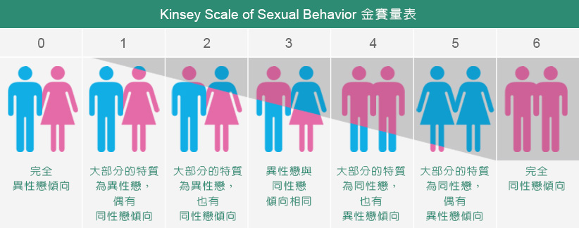

**性取向**（英语：sexual orientation），或称**性倾向**、**性向**，是指一个人对特定[性别](https://zh.wikipedia.org/wiki/%E6%80%A7%E5%88%A5)的持久性[情感](https://zh.wikipedia.org/wiki/%E6%83%85%E6%84%9F)、[浪漫](https://zh.wikipedia.org/wiki/%E6%B5%AA%E6%BC%AB)、与[性](https://zh.wikipedia.org/wiki/%E6%80%A7%E6%84%9B)吸引力。最近几十年的研究表明，性倾向如同[肤色](https://zh.wikipedia.org/wiki/%E8%86%9A%E8%89%B2)，是个程度渐进的连续概念，属于[性别光谱](https://zh.wikipedia.org/wiki/%E6%80%A7%E5%88%A5%E5%85%89%E8%AD%9C)的一环。每个人的性倾向位于从“只对异性感兴趣”到“只对同性感兴趣”之间的某个位置。

通常，性取向被归为四类：[异性恋](https://zh.wikipedia.org/wiki/%E7%95%B0%E6%80%A7%E6%88%80)（对异性产生浪漫情感与性的吸引）、[同性恋](https://zh.wikipedia.org/wiki/%E5%90%8C%E6%80%A7%E6%88%80)（对同性产生浪漫情感与性的吸引）、[双性恋](https://zh.wikipedia.org/wiki/%E9%9B%99%E6%80%A7%E6%88%80)（对两性均能产生浪漫情感与性的吸引）、[无性恋](https://zh.wikipedia.org/wiki/%E7%84%A1%E6%80%A7%E6%88%80)（对两性均无浪漫情感或性的吸引）等概念。

此外为了避免性别二分法，亦有其他的分类方法：[男性向](https://zh.wikipedia.org/wiki/%E7%94%B7%E6%80%A7%E5%90%91)（对男性产生浪漫情感与性的吸引）、[女性向](https://zh.wikipedia.org/wiki/%E5%A5%B3%E6%80%A7%E5%90%91)（对女性产生浪漫情感与性的吸引）、[双性向](https://zh.wikipedia.org/wiki/%E9%9B%99%E6%80%A7%E5%90%91)（对两性均能产生浪漫情感与性的吸引）、[无性向](https://zh.wikipedia.org/wiki/%E7%84%A1%E6%80%A7%E5%90%91)（对两性均无浪漫情感或性的吸引）。[[1\]](https://zh.wikipedia.org/wiki/%E6%80%A7%E5%8F%96%E5%90%91#cite_note-1)性倾向的多样情况，在[人类历史](https://zh.wikipedia.org/wiki/%E4%BA%BA%E9%A1%9E%E6%AD%B7%E5%8F%B2)和世界不同国家与文化中都有描述。研究表明，性倾向形成于[童年](https://zh.wikipedia.org/wiki/%E7%AB%A5%E5%B9%B4)或[青少年](https://zh.wikipedia.org/wiki/%E9%9D%92%E5%B0%91%E5%B9%B4)早期。没有科学研究足以证明“改变性倾向”的治疗是安全或有效的；事实上，对于同性恋者或双性恋者，这些治疗通常带来负面影响或心理阴影。

性倾向和其他跟性身份有关的几个概念是相互区分的：

“生理[性别](https://zh.wikipedia.org/wiki/%E6%80%A7%E5%88%A5)”（biological sex）是指男性或女性的[解剖学](https://zh.wikipedia.org/wiki/%E8%A7%A3%E5%89%96%E5%AD%B8)、[生理学](https://zh.wikipedia.org/wiki/%E7%94%9F%E7%90%86%E5%AD%B8)、[遗传学](https://zh.wikipedia.org/wiki/%E9%81%BA%E5%82%B3%E5%AD%B8)特征；

“[性别认同](https://zh.wikipedia.org/wiki/%E6%80%A7%E5%88%A5%E8%AA%8D%E5%90%8C)”（gender identity）是指一个人将自己视为男性或女性的心理认同；

“[性别的社会角色](https://zh.wikipedia.org/wiki/%E6%80%A7%E5%88%A5%E8%A7%92%E8%89%B2)”是指社会对出生男性、出生女性（排除双性人）的行为期待和文化规范，也通常是性别[刻板印象](https://zh.wikipedia.org/wiki/%E5%88%BB%E6%9D%BF%E5%8D%B0%E8%B1%A1)的来源。

**LGBT**是[女同性恋者](https://zh.wikipedia.org/wiki/%E5%A5%B3%E5%90%8C%E6%80%A7%E6%88%80%E8%80%85)（**L**esbian）、[男同性恋者](https://zh.wikipedia.org/wiki/%E7%94%B7%E5%90%8C%E6%80%A7%E6%88%80%E8%80%85)（**G**ay）、[双性恋者](https://zh.wikipedia.org/wiki/%E9%9B%99%E6%80%A7%E6%88%80%E8%80%85)（**B**isexual）与[跨性别者](https://zh.wikipedia.org/wiki/%E8%B7%A8%E6%80%A7%E5%88%A5%E8%80%85)（**T**ransgender）的英文[首字母缩略字](https://zh.wikipedia.org/wiki/%E9%A6%96%E5%AD%97%E6%AF%8D%E7%B8%AE%E7%95%A5%E5%AD%97)。1990年代，由于“[同性恋社群](https://zh.wikipedia.org/wiki/%E5%90%8C%E6%80%A7%E6%88%80%E7%A4%BE%E7%BE%A4)”一词无法完整体现相关群体，“LGBT”一词便应运而生、并逐渐普及[[1\]](https://zh.wikipedia.org/wiki/LGBT#cite_note-Gay_Pride_Nee-1)。在现代用语中，“LGBT”一词、除了狭义的指[同性恋](https://zh.wikipedia.org/wiki/%E5%90%8C%E6%80%A7%E6%88%80)、双性恋或跨性别族群，也可广泛代表所有[非异性恋者](https://zh.wikipedia.org/wiki/%E9%9D%9E%E7%95%B0%E6%80%A7%E6%88%80)[[1\]](https://zh.wikipedia.org/wiki/LGBT#cite_note-Gay_Pride_Nee-1)[[2\]](https://zh.wikipedia.org/wiki/LGBT#cite_note-The_Handbook_of_Lesb1-2)。另外，也有在词语后方加上字母“Q”，代表[酷儿](https://zh.wikipedia.org/wiki/%E9%85%B7%E5%84%BF_(LGBT))（Queer）和/或对其性别认同感到疑惑的人（Questioning），即是“**LGBTQ**”。LGBT现今已获得了许多[英语系国家](https://zh.wikipedia.org/wiki/%E8%8B%B1%E8%AA%9E%E5%9C%8B%E5%AE%B6%E5%92%8C%E5%9C%B0%E5%8D%80%E5%88%97%E8%A1%A8)中多数LGBT族群和LGBT媒体的认同及采用，成为一种非常主流的用法[[3\]](https://zh.wikipedia.org/wiki/LGBT#cite_note-3)[[4\]](https://zh.wikipedia.org/wiki/LGBT#cite_note-4)。坊间有不少LGBT的资源中心，提供不少有关LGBT的中文文章，包括医学、心理学、社会科学及法律的文章，是一个研究LGBT议题人士搜寻资料的地方。

然而，“LGBT”的用法并非没有争议[[5\]](https://zh.wikipedia.org/wiki/LGBT#cite_note-Counseling_Lesbian,_G-5)。部分[双性人](https://zh.wikipedia.org/wiki/%E9%9B%99%E6%80%A7%E4%BA%BA)（intersex）认为自己也属于LGBT族群中，因此支持使用“**LGBTI**”[[6\]](https://zh.wikipedia.org/wiki/LGBT#cite_note-Challenging_Lesbian_Nor-6)[[7\]](https://zh.wikipedia.org/wiki/LGBT#cite_note-Fenway_Guide-7)。也有个别族群不认为自己和LGBT所涵盖的其他族群有所关联[[8\]](https://zh.wikipedia.org/wiki/LGBT#cite_note-In-Between_Bodies-8)。有人基于“同性恋分离主义”思想，认为男、女同性恋者应脱离其他族群成为另一个团体[[8\]](https://zh.wikipedia.org/wiki/LGBT#cite_note-In-Between_Bodies-8)[[9\]](https://zh.wikipedia.org/wiki/LGBT#cite_note-Gays/Justice-9)，理由是跨性别和变性者与同性恋人士不同[[10\]](https://zh.wikipedia.org/wiki/LGBT#cite_note-Coming_Out_in_Christi-10)。有人则认为“LGBT”这个用语太过[政治正确](https://zh.wikipedia.org/wiki/%E6%94%BF%E6%B2%BB%E6%AD%A3%E7%A2%BA)，企图将[多元性别](https://zh.wikipedia.org/wiki/%E5%A4%9A%E5%85%83%E6%80%A7%E5%88%A5)族群划入灰色地带，意味着包含主流性别族群的问题和优先权都获得了平等的考量

**跨性别男性（**Transman) 是出生时[性别指定](https://zh.wikipedia.org/wiki/%E6%80%A7%E5%88%A5%E6%8C%87%E5%AE%9A)为女性的男性

**跨性别女性**（Transwoman)是出生时[性别指定](https://zh.wikipedia.org/wiki/%E6%80%A7%E5%88%A5%E6%8C%87%E5%AE%9A)为男性的女性

**性别指定**有时称为**出生性别指定**， 是根据出生时检查性别特征以确定[婴儿](https://zh.wikipedia.org/wiki/%E5%AC%B0%E5%85%92)的[法定性别](https://zh.wikipedia.org/wiki/%E6%B3%95%E5%AE%9A%E6%80%A7%E5%88%AB)。[[1\]](https://zh.wikipedia.org/wiki/%E6%80%A7%E5%88%A5%E6%8C%87%E5%AE%9A#cite_note-reiner1997-1) 在大多数[分娩](https://zh.wikipedia.org/wiki/%E5%88%86%E5%A8%A9)中，[亲属](https://zh.wikipedia.org/wiki/%E4%BA%B2%E5%B1%9E)、[助产士](https://zh.wikipedia.org/w/index.php?title=%E5%8A%A9%E4%BA%A7%E5%A3%AB&action=edit&redlink=1)、[护士](https://zh.wikipedia.org/wiki/%E6%8A%A4%E5%A3%AB)或[医生](https://zh.wikipedia.org/wiki/%E5%8C%BB%E7%94%9F)在婴儿分娩时检查[生殖器](https://zh.wikipedia.org/wiki/%E7%94%9F%E6%AE%96%E5%99%A8)，并指定出生性别，而排除含糊不清的[双性人](https://zh.wikipedia.org/wiki/%E9%9B%99%E6%80%A7%E4%BA%BA)。出生性别也可以在分娩前通过产前性别鉴别完成。[[2\]](https://zh.wikipedia.org/wiki/%E6%80%A7%E5%88%A5%E6%8C%87%E5%AE%9A#cite_note-reiner2002-2)

在大多数情况下，出生时的性别指定与孩子的[生物性别](https://zh.wikipedia.org/wiki/%E7%94%9F%E7%89%A9%E6%80%A7%E5%88%AB)相符。婴儿并非未真正符合女性和男性严格定义的出生人数可能高达1.7％，其中0.5％是有着明显含糊的生殖器。[[3\]](https://zh.wikipedia.org/wiki/%E6%80%A7%E5%88%A5%E6%8C%87%E5%AE%9A#cite_note-3)[[4\]](https://zh.wikipedia.org/wiki/%E6%80%A7%E5%88%A5%E6%8C%87%E5%AE%9A#cite_note-4)[[5\]](https://zh.wikipedia.org/wiki/%E6%80%A7%E5%88%A5%E6%8C%87%E5%AE%9A#cite_note-5) 其他原因包括非典型染色体，性腺或激素。[[6\]](https://zh.wikipedia.org/wiki/%E6%80%A7%E5%88%A5%E6%8C%87%E5%AE%9A#cite_note-un-fact-6)这些情况被统称为[双性人](https://zh.wikipedia.org/wiki/%E9%9B%99%E6%80%A7%E4%BA%BA)或[性别分化障碍](https://zh.wikipedia.org/wiki/%E6%80%A7%E5%88%A5%E5%88%86%E5%8C%96%E9%9A%9C%E7%A4%99)，并可能使性别指定任务复杂化。[[7\]](https://zh.wikipedia.org/wiki/%E6%80%A7%E5%88%A5%E6%8C%87%E5%AE%9A#cite_note-7)更改出生性别登记规定必须通过[性别重置手术](https://zh.wikipedia.org/wiki/%E6%80%A7%E5%88%A5%E9%87%8D%E7%BD%AE%E6%89%8B%E8%A1%93)或[性别转换疗法](https://zh.wikipedia.org/wiki/%E6%80%A7%E5%88%A5%E8%BD%89%E6%8F%9B%E7%99%82%E6%B3%95)来更改性别特征可能会侵犯个人的权利。

> 以上引自 维基百科

一个生理性别为男的，但性别认同是女的，这样的虽然是生理上的同性，但是属于异性恋

| 我的特质   | 类别                                                         | 属性                                                    | 社会争议                                                     |
| ---------- | ------------------------------------------------------------ | ------------------------------------------------------- | ------------------------------------------------------------ |
| 我生下来是 |       |  | 男女平等/家庭崗位                                            |
| 我觉得我是 |  |     | [跨性別](http://www.newtouch.net/liberalstudies/section3a_2.php)/[第三性](http://www.newtouch.net/liberalstudies/section3a_3.php) |
| 我看起来像 |          |     | 娘娘腔/男人婆                                                |
| 我喜欢的是 |          |     | 同性戀/雙性戀/異性戀                                         |

> 以上两张图表引自  [性向无限计划](http://www.newtouch.net/liberalstudies/section3a.php)

自我评价

生理性别 男

性别认同 男

性别的社会角色 男

性倾向 男 １% 女 99%

