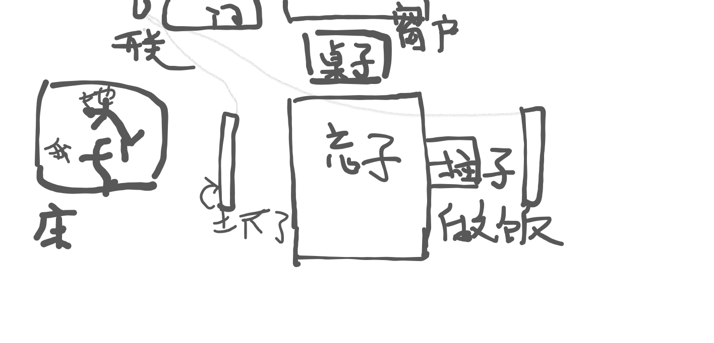

下午我做了个梦,梦到我和她结婚了

开始我记得,我找到工作了,5000元一月.我好高兴,没想到这么顺利.

接着我们在一起了,租了个大房子,我们还在那里做饭.

好像灯坏掉了,我抱怨了一下.就去修灯.

我走到开关前,开了下,又关上,她说:"本来开开后,两边都亮的".    中断

我躺在旁边的床上,她也躺在上面,睁开眼,感觉好累.  中断

好像是她姐姐来了,还有其他人.我们一起吃饭,我感觉好吵,但某一瞬间,我感觉,这不是家的感觉吗?真是好温馨的感觉.

然后我去关门,但怎么都关不上,她还跑过来帮我关门.

有时我想,5000块太少了吧,但我又不能辞职,以后也不能随便换住的地方了

中断

她姐姐开着车带着她和我去了医院,回去时,我问为什么要去医院,她姐姐笑着看着不好意思的她,然后转向我说:你们不是要结婚了吗"

车上颠簸,坐在后排的我想要跟前排的她说话,但望着她的背影,我竟然忘记了她的名字.

我慌张而又疑惑的想着,终于想起来了,梦中我清清楚楚的说出了她的名字,但醒来后我还是忘了,只记得当时好像说了三个字? 只记得想了一会儿记起了她的名字

 特别是醒来的时候,看着天花板,我忘记了时间,依据阳光,我还以为是早上.

过了好大一会儿我才记起现在是下午了

